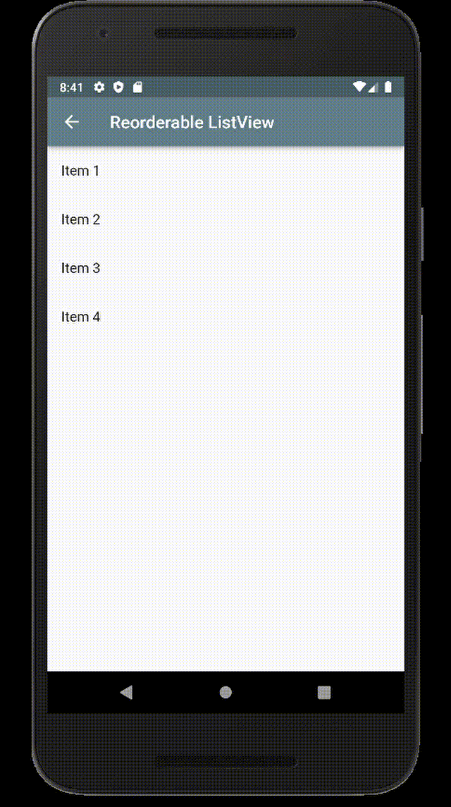
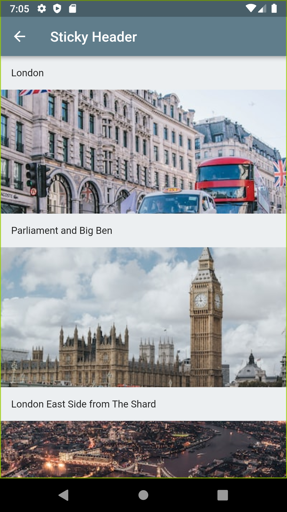
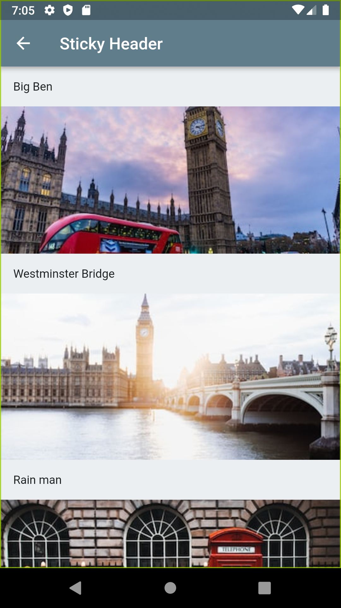

Note: To run the application, create a urls.dart file in the bin directory and define your own unsplash clientId variable.

# 13 ListView Widgets 🦋
1. Pull To Refresh
2. Infinite Scrolling ListView
3. Spread Operator
4. Nested Columns and ListViews
5. SingleChildScrollView
6. ListView With JSON Data
7. Sticky Header
8. Search & Filter ListView
9. Reorderable ListView
10. ListView With Navigator
11. Horizontal ListView
12. Vertical ListView
13. Grouped ListView

 
 
 
 
  
  

source: https://www.youtube.com/watch?v=L3NJkkOC4Ko 

